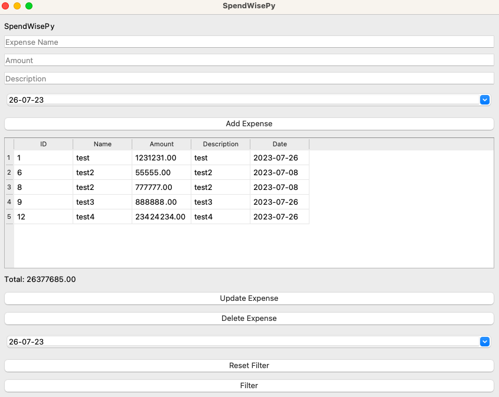

<!-- SpendWisePy - Expense Tracker Application -->

# SpendWisePy 📈💰
SpendWisePy is a simple expense tracker application that allows users to create and manage their expenses.

SpendWisePy is a simple and intuitive expense tracking application built in Python by Felipe Alfonso Gonzalez, a passionate Computer Science Engineer from Chile. 💻🚀

This open-source project comes with dual licensing options: MIT and GPL. Feel free to use, modify, and distribute the software under these permissive licenses. However, if you utilize the source code or create a fork, please kindly attribute Felipe Alfonso Gonzalez as the original creator and the brilliant mind behind this expense management tool. 😊

## Features ✨🚀 

- Create, manage, and track your expenses effortlessly from the comfort of your terminal.
- Add expense details such as name, amount, description, and date.
- Update and delete expenses easily with a user-friendly interface.
- Filter expenses by date range to get better insights.
- Total expenses displayed for easy monitoring.
- User-friendly GUI powered by PyQt5.
- Supports multiple operating systems including Windows, macOS, and Linux.

## Prerequisites

Before running SpendWisePy, make sure you have the following dependencies installed:

- Python 3
- PyQt5: Install PyQt5 library using pip:

## How to Use 🚀

1. Clone the repository using `git clone`.
2. Install the required dependencies with `pip install -r requirements.txt`.
3. Run the application using `python3 spendwiseapp.py`.
4. Start managing your expenses efficiently!

## How to Run

1. Clone the SpendWisePy repository from GitHub.

2. Navigate to the project directory:

3. Run the main application script:

4. The SpendWisePy application will launch.

5. To exit the application, close the main window.

🛠️ Database
- SpendWisePy uses a custom database model. Make sure to include the appropriate model or adapt it for your needs.

## Contributing

Contributions to this project are more than welcome! If you have any ideas, bug fixes, or new features to add, please feel free to open an issue or submit a pull request. Let's make SpendWisePy even better together! 🤝

🤝 If you'd like to contribute to SpendWisePy, please follow these steps:
1. Fork the repository.
2. Create your feature branch (`git checkout -b feature/YourFeature`).
3. Commit your changes (`git commit -m 'Add some feature'`).
4. Push to the branch (`git push origin feature/YourFeature`).
5. Open a pull request.

## Contact

📧 For any questions or suggestions, feel free to contact the developer:
- Name: Felipe Alfonso Gonzalez
- Email: f.alfonso@res-ear.ch
- GitHub: [felipealfonsog](https://github.com/felipealfonsog)

## Support

☕ If you find SpendWisePy helpful, consider supporting the project with a cup of coffee:

- [Sponsor on Paypal](https://paypal.com/felipealfonsog)
- [Buy me a coffee](https://www.buymeacoffee.com/felipealfonsog)
- [Sponsor on GitHub](https://github.com/sponsors/felipealfonsog)

🙏 Your support is greatly appreciated!

---

Happy expense tracking! 📊💸

